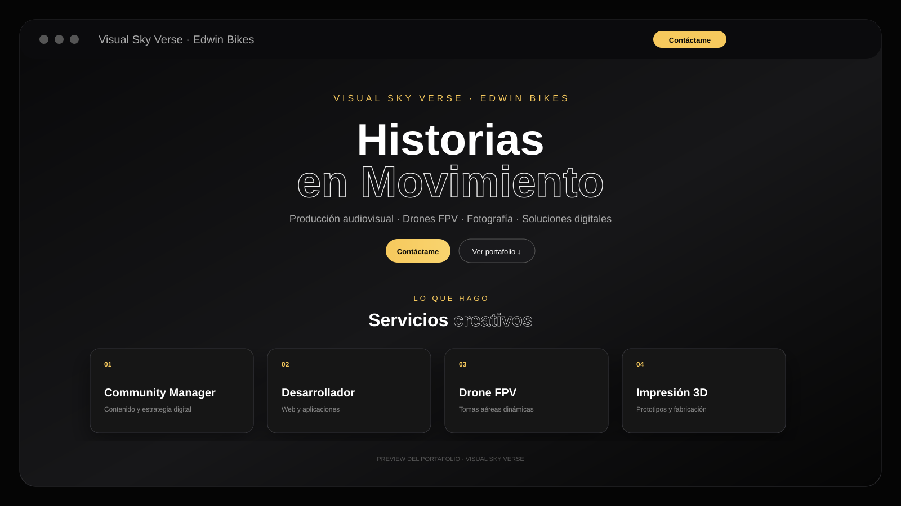

# Visual Sky Verse — Portafolio de Edwin Bikes



## 🎬 Sobre el proyecto

**Visual Sky Verse** es el portafolio personal de **Edwin Bikes**, creado para reunir en un solo lugar diferentes áreas de trabajo creativo y tecnológico.

La página combina **producción audiovisual, drones FPV, fotografía, creación de contenido, Community Management, desarrollo de aplicaciones y web e impresión 3D**, con una interfaz oscura, moderna y enfocada en lo visual.

## ✦ Servicios

- **Community Manager** — contenido, estrategia y presencia digital para marcas y negocios.
- **Desarrollador** — aplicaciones móviles, proyectos web y soluciones digitales.
- **Piloto de Drone FPV** — producción aérea dinámica para proyectos comerciales, automotrices, inmobiliarios, turísticos y eventos.
- **Impresión 3D** — prototipado, piezas personalizadas y fabricación.

## 🚀 Características

- Landing page moderna y responsive.
- Navegación por secciones.
- Modales interactivos para cada especialidad.
- Galerías de imágenes y proyectos.
- Integración de videos de **YouTube, Instagram y TikTok**.
- Contador de visitas.
- Enlaces directos a redes sociales y WhatsApp.
- Portafolio de proyectos de desarrollo.
- Diseño adaptado para computadores, tablets y móviles.

## 🛠️ Tecnologías

- HTML5
- CSS3
- JavaScript
- Ionicons
- YouTube Embed
- Instagram Embed
- TikTok Embed

## 🌐 Portafolio

Visita el portafolio de Edwin Bikes:

**https://portfolio-edwinbikes.vercel.app/**

## 📁 Estructura principal

```text
assets/
├── css/
│   └── style.css
├── js/
│   └── script.js
├── images/
└── videos/
index.html
README.md
```

## 👤 Edwin Bikes

**Visual Sky Verse · Edwin Bikes**

Producción audiovisual · Drones FPV · Fotografía · Desarrollo digital

---
